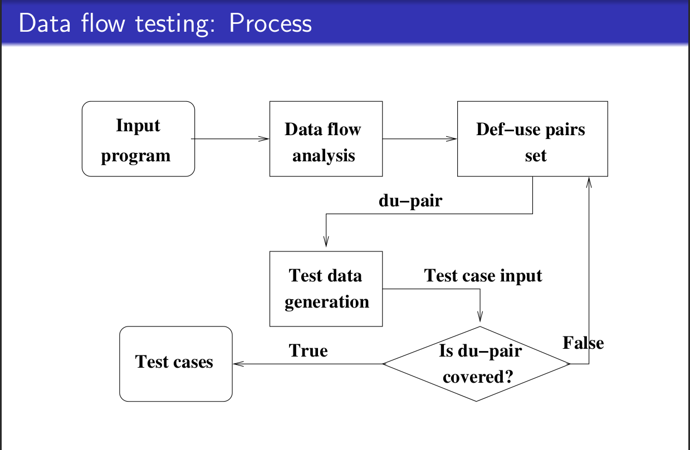

# Software Testing Project

### Chinmay Parekh - IMT2020069
### Darshak Jivrajani - IMT2020119

### Abstract
This document contains details and problems for a project in CS731 course
in Software Testing. The goal of project work is to self-learn and understand
the practical aspects of testing, through use of open source tools and the test
case design strategies learnt in the course.We have developed a code for Payroll Management System in python for performing and analysis of data flow graphs.

### Introduction
Many software fails due to a lack of testing various aspects of the program. Software Testing is
a very crucial phase for Software Development. Software testing is important as it verifies the
customer’s reliability and their content with the application. In this project, we focus on
Graph-based testing(Data flow graphs) of source code which is a white box technique.

### Code
The Payroll Management System is a menu driven program where users can add records, remove records, modify records, delete records, or search records. The salary records (salary statement and salary slip) can also be displayed for all employees.
The <code>employee_file.txt</code> is attached for reference and better understanding.

### Steps Involved

1. Identify Variables: Identify all the variables in the code that are affected by the functionality under test.

2. Create Data Flow Graph: Create a graph where nodes represent program statements and edges represent data flow between these statements.
3. Identify Defs and Uses: Identify all the definitions and uses of the variables used in the program.

4. Create Test Cases: Find du-pairs for variables are create suitable test cases.The test case should include input data that will cause the path to be executed and expected output data.

5. Analyze Results: Analyze the results of the test cases to identify any defects in the code. If a test case fails, there is a defect in the code that needs to be fixed.

6. Repeat: After fixing any defects, repeat the process until all test cases pass.

### Tools and Libraries
We used the following tool to visualize and generate the test requirements for our code:
[DFG Tool](http://cs.gmu.edu:8080/offutt/coverage/DFGraphCoverage)

For generating the data flow graphs we made use of the pycfg library. It can be installed using the following command:

    sudo pip install pycfg

For additional information regarding it's setup, refer to:
[Link](https://www.geeksforgeeks.org/draw-control-flow-graph-using-pycfg-python/)

For generating test cases for the code,we made use of Pytest which is a testing framework based on python. It is mainly used to write API test cases and unit tests.
It can be installed using the following command:
    
    pip install pytest

### Inference and Results(Add screenshots)

We ran test cases on the following functions to meet the test requirements which are as follows:

[modif1] (add link)

[modif2](https://cs.gmu.edu:8443/offutt/coverage/DFGraphCoverage?edges=1+2%0D%0A2+3%0D%0A3+4%0D%0A4+5%0D%0A5+6%0D%0A6+7%0D%0A6+8%0D%0A8+9%0D%0A9+10%0D%0A10+11%0D%0A9+11%0D%0A11+2%0D%0A4+11%0D%0A2+12%0D%0A12+13%0D%0A12+14%0D%0A13+14%0D%0A14+15%0D%0A15+16%0D%0A14+16%0D%0A&initialNode=1&endNode=7+16&defs=fin%201%0D%0Afout%201%0D%0Ano%201%0D%0Adg%201%0D%0Asal%201%0D%0Afound%201%205%0D%0Adata%203%0D%0Anewdes%205%0D%0Anewbs%205%0D%0Ach%208%0D%0A&uses=fin%202%203%2014%0D%0Afout%2011%2014%0D%0Ano%204%0D%0Adg%205%0D%0Asal%205%0D%0Afound%2012%2014%0D%0Adata%203%0D%0Anewdes%206%2010%0D%0Anewbs%206%2010%0D%0Ach%209%0D%0A&action=All%20DU%20Path%20Coverage)

[display](https://cs.gmu.edu:8443/offutt/coverage/DFGraphCoverage?edges=1+2%0D%0A2+3%0D%0A2+4%0D%0A3+5%0D%0A5+2%0D%0A&initialNode=1&endNode=4&defs=fin%201%0D%0Aeno%201%0D%0A&uses=fin%202%204%0D%0Aeno%205%0D%0A&action=All%20DU%20Path%20Coverage)

### Contributions

Chinmay - Setup the various tools and libraries for testing the code, created the data flow graphs, test requirements and wrote half of the unit tests.

Darshak - Wrote the base code and refactored it appropriately to make it suitable for testing and wrote half of the unit tests.
